# Nextjs Stuff

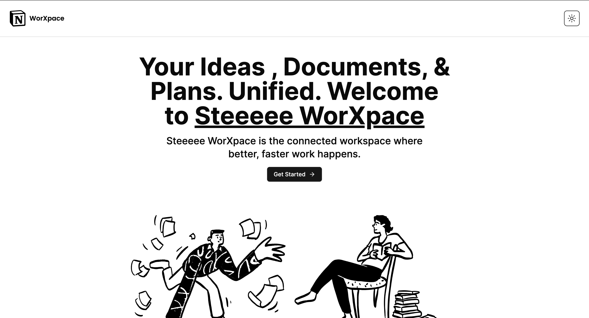

### Apps

- [Steeeee WorXpace](https://worxpace.steeeee0223.vercel.app/)
- [Component Storybook](https://storybook.steeeee0223.vercel.app/)

### Features & Demo

##### 🤑 Custom notion-style rich text editor

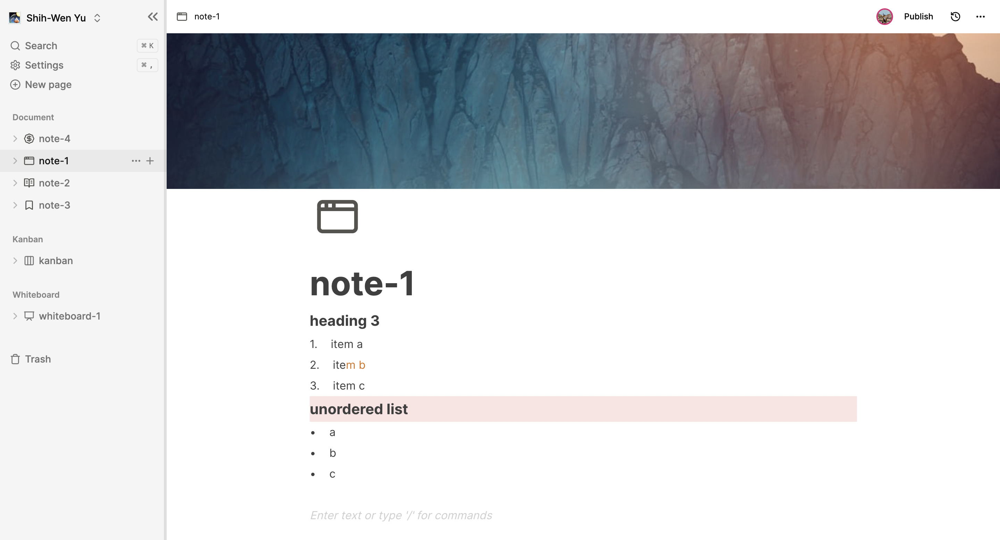

##### 🪧 Custom kanban board

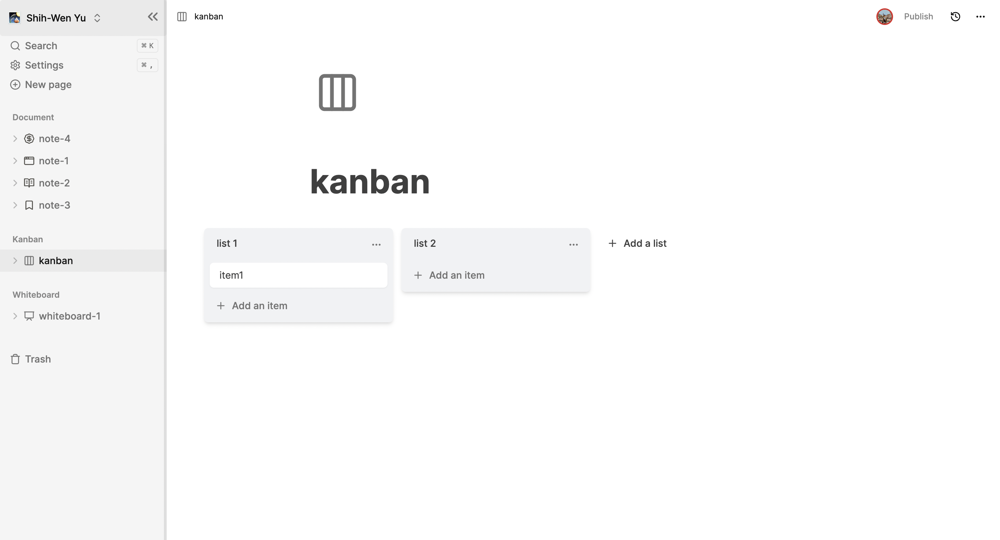

##### 💅 Custom whiteboard

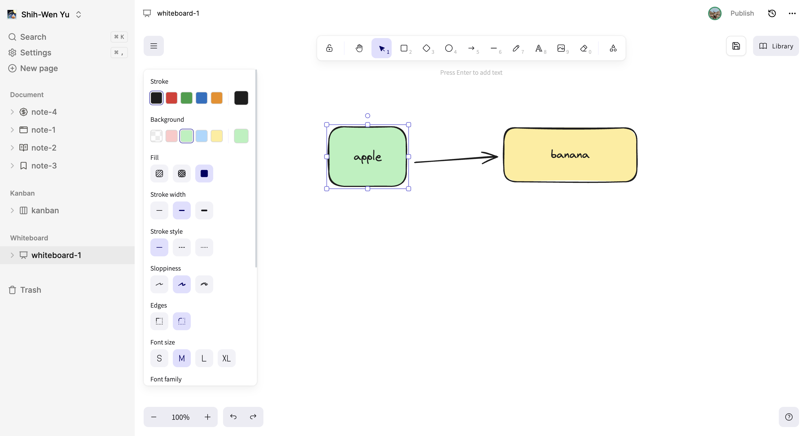

##### 🚀 Workspace switcher: Create a new workspace

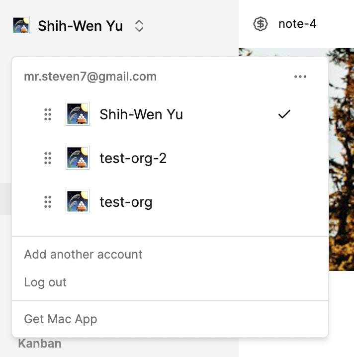

##### 🗑️ Move-to-trash functionality

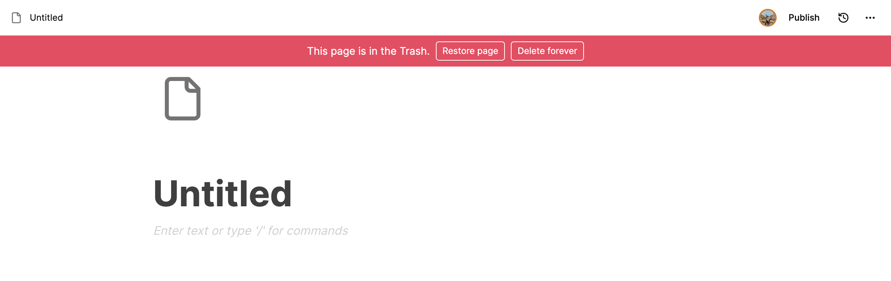

##### 🔍 Page searching

##### 🔗 Page sharing

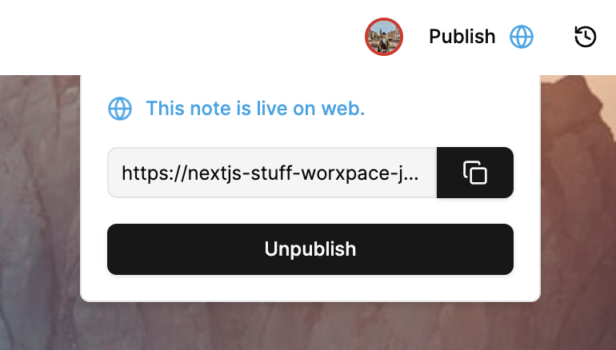

##### 👨‍👨‍👧‍👦 Real-time collaboration: cursors, text selection, presence

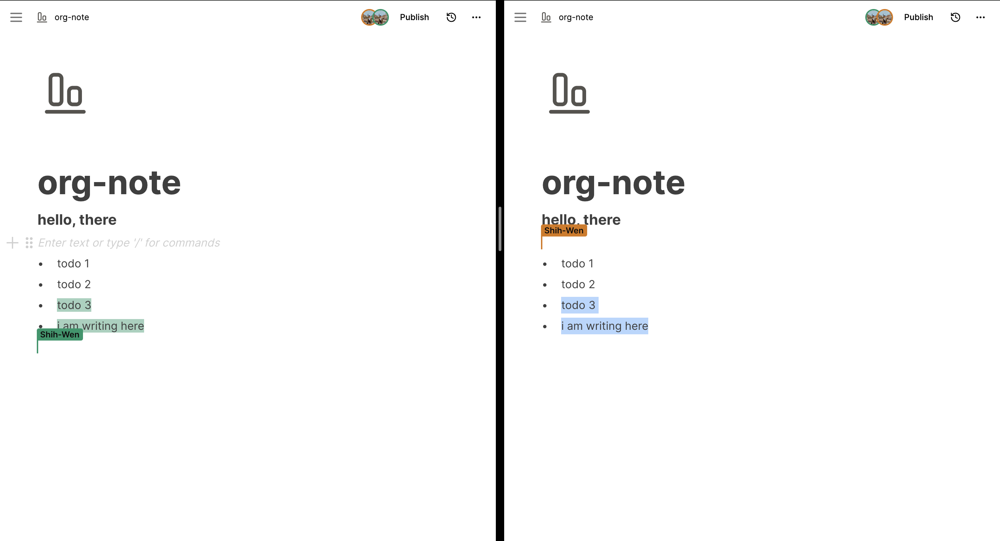

##### 😜 Custom emoji picker: emoji, lucide icons & custom upload

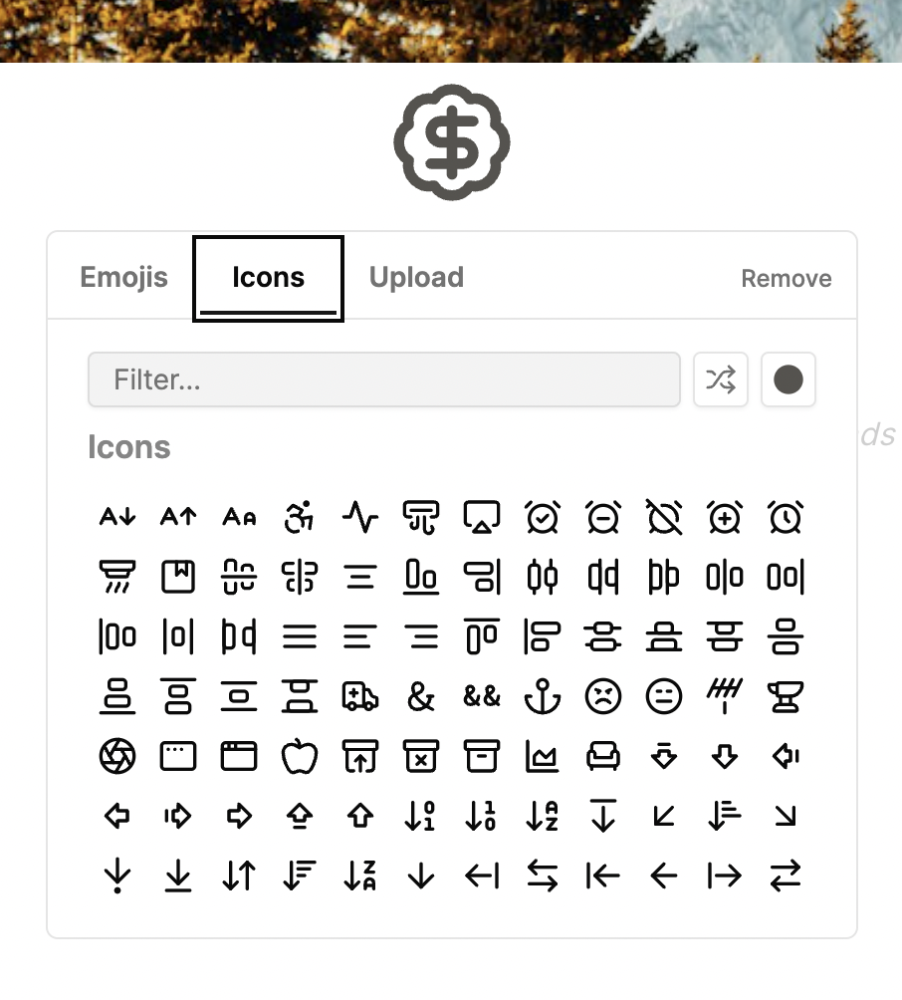

##### 🏙️ Custom cover picker: unsplash & custom upload

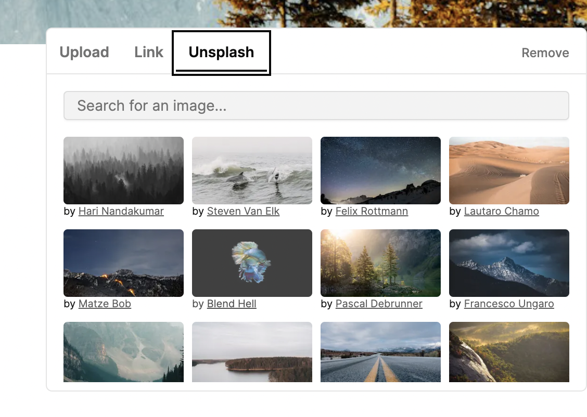

##### 🕑 Page histories

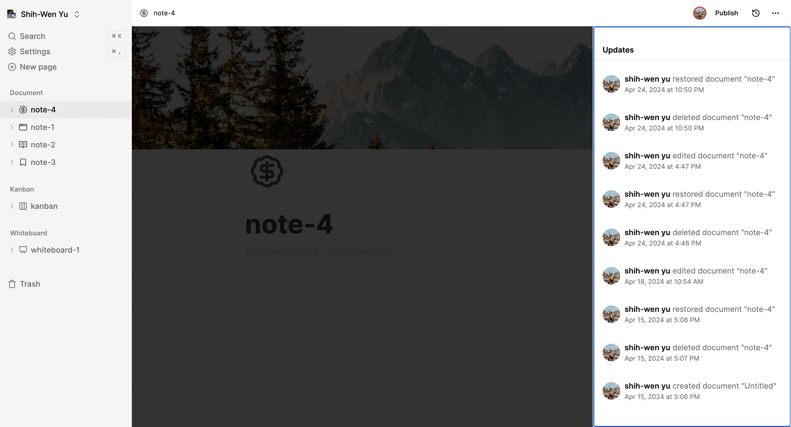

##### ⚙️ Settings panel

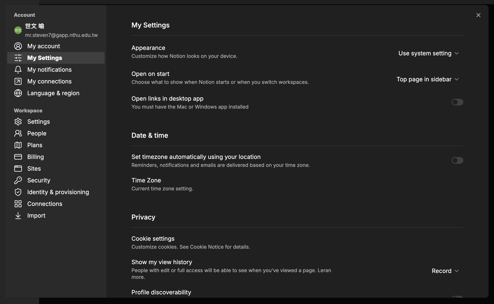

##### 🌎 (Partially) Support locales: EN/DE/ES

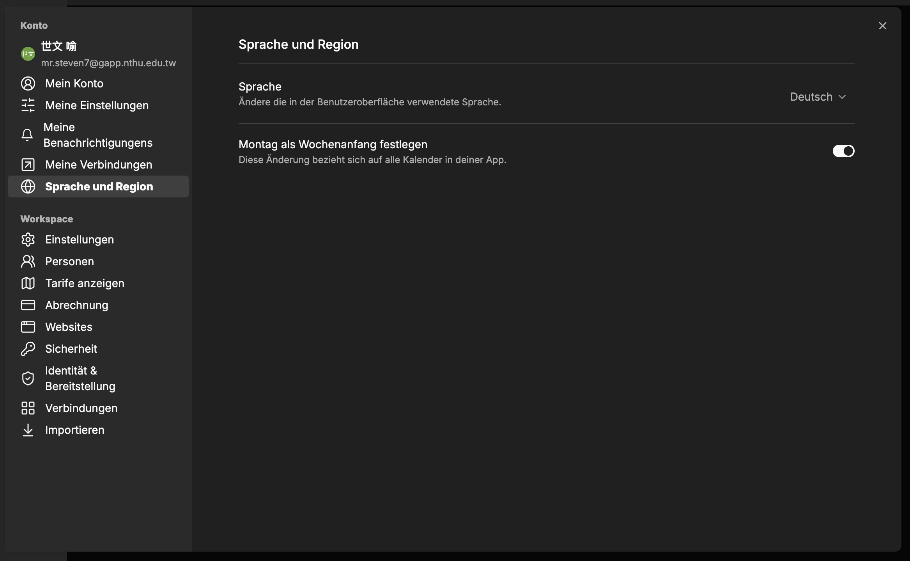

### TODO

- [ ] 🗺️ Creating free plan restrictions
